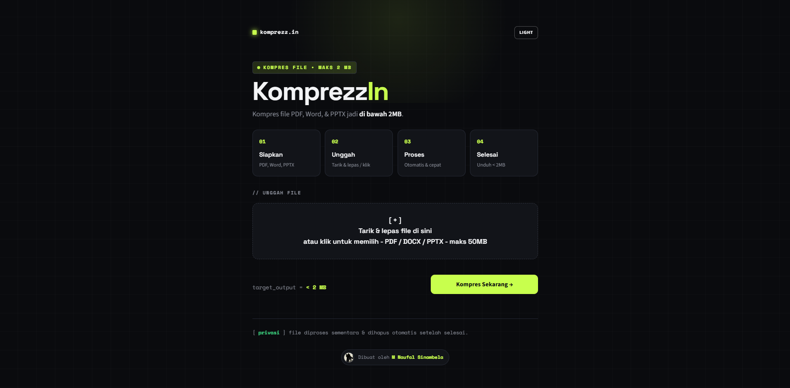

<div align="center">
  <h1><strong>KomprezzIn</strong></h1>

  <p><b>Aplikasi web modern untuk mengompresi file PDF, DOCX, dan PPTX di bawah 2MB.</b></p>

  <p>
    
    
    
  </p>

  <p>
    <a href="#fitur-utama">Fitur Utama</a> •
    <a href="#tech-stack">Tech Stack</a> •
    <a href="#cara-menjalankan-secara-lokal">Cara Menjalankan</a> •
    <a href="#struktur-proyek">Struktur Proyek</a>
  </p>

  
</div>

---

KomprezzIn dirancang untuk memecahkan masalah batas ukuran unggahan tugas kuliah pada Learning Management System (LMS) kampus yang membatasi berkas maksimal 2MB. 

<div align="center">
  <h3><b>Coba aplikasinya:</b></h3>
  <p><a href="https://komprezzin.streamlit.app/">https://komprezzin.streamlit.app/</a></p>
</div>

KomprezzIn dapat diakses secara daring kapan saja tanpa perlu instalasi aplikasi atau registrasi akun. Meskipun berjalan di *cloud*, aplikasi ini didesain sepenuhnya *stateless* (tanpa database). Semua berkas diproses secara sementara di dalam memori server dan langsung dihapus setelah sesi berakhir guna menjamin privasi dokumen Anda secara penuh.

## ✨ Fitur Utama

- **Dukungan Multi-Format:** Mengompresi berkas PDF, DOCX (Word), dan PPTX (PowerPoint).
- **Proses Sekaligus (Batch):** Mendukung pengunggahan hingga 5 berkas dalam satu sesi.
- **Kompresi Cerdas & Iteratif:** Menggunakan algoritma penyesuaian kualitas secara bertahap hingga berkas mencapai target, dilengkapi fitur *early-exit* untuk efisiensi server.
- **Tanpa Database (Stateless):** Berkas hanya disimpan sementara di folder temp memori server dan langsung dihapus setelah sesi selesai.
- **Unduh Dinamis:** Mengunduh berkas tunggal secara instan dengan format asli, atau mengunduh banyak berkas sekaligus dalam satu arsip ZIP.
- **UI Modern & Responsif:** Menggunakan gaya desain modern *(Clean UI)* yang mendukung eksekusi re-render parsial (`@st.fragment`). Tersedia pilihan tema gelap (default) dan tema terang.

## 🛠 Tech Stack

- **Framework Utama:** Python 3 + Streamlit
- **Mesin PDF:** Ghostscript + pikepdf
- **Mesin Dokumen & PPT:** python-docx + python-pptx + Pillow

## 📂 Struktur Proyek

Aplikasi ini dibangun dengan mengedepankan prinsip *Clean Code* dan pemisahan logika (Separation of Concerns):
- `app.py`: Titik masuk utama aplikasi (Main UI routing & state management).
- `assets/`: Berisi file *stylesheet* CSS terpisah (`main.css`, tema gelap & terang) yang di-*cache* untuk performa.
- `components/`: Berisi logika fungsi *render helper* antarmuka (HTML komponen).
- `engine/`: Direktori pemrosesan (*backend*). Berisi algoritma kompresi spesifik untuk PDF, DOCX, dan PPTX, serta utilitas pengelolaan file sementara (*temp*).

## 🚀 Cara Menjalankan Secara Lokal

### 1. Persyaratan Sistem
Pastikan Anda sudah menginstal:
- Python 3.8 atau lebih baru.
- **Ghostscript** (Wajib diinstal agar proses kompresi PDF berfungsi):
  - Windows: Unduh installer resmi Ghostscript.
  - Linux/Debian: `sudo apt-get install ghostscript`
  - Mac: `brew install ghostscript`

### 2. Instalasi
Salin repositori ini dan masuk ke direktori utama:
```bash
git clone https://github.com/nnxv4l/KomprezzIn.git
cd KomprezzIn
```

Buat virtual environment dan instal seluruh dependensi:
```bash
python -m venv venv
# Windows: venv\Scripts\activate
# Mac/Linux: source venv/bin/activate

pip install -r requirements.txt
```

### 3. Menjalankan Aplikasi
Jalankan perintah berikut untuk membuka server Streamlit:
```bash
streamlit run app.py
```
Aplikasi akan terbuka secara otomatis pada peramban web di `http://localhost:8501`.

## ☁️ Deployment

Aplikasi ini siap dideploy secara instan pada **Streamlit Community Cloud**:
- Server Streamlit akan membaca berkas `requirements.txt` untuk menginstal pustaka Python.
- Server akan membaca berkas `packages.txt` untuk menginstal dependensi tingkat sistem (`ghostscript`) secara otomatis.


## ⚠️ Batasan (Limitations)
- Proses kompresi bergantung pada CPU server. Untuk dokumen yang berisi ratusan halaman hasil pemindaian (*scan*) resolusi tinggi (raster), proses kompresi mungkin membutuhkan waktu lebih lama.
- Jika dokumen tidak dapat dikompresi di bawah 2MB setelah melalui iterasi maksimum, aplikasi akan memberikan peringatan dan menyarankan pengguna untuk mengecilkan resolusi gambar secara manual.

## 📝 Lisensi
Proyek ini didistribusikan di bawah lisensi **MIT**. Lihat berkas [LICENSE](LICENSE) untuk informasi lebih lanjut.
